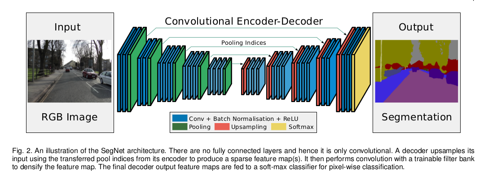
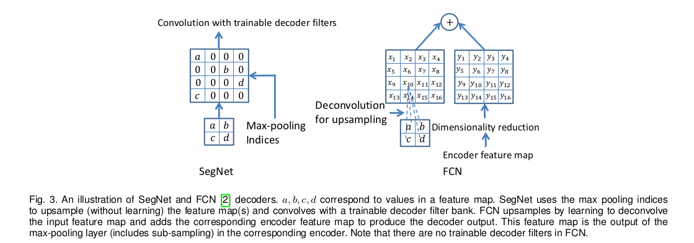

SegNet: A Deep Convolutional Encoder-Decoder Architecture for Image Segmentation
=

# Architecture
整体架构如图2 ，包含一个编码器和一个解码器，最后是逐像素分类层。

编码器包含13个卷积层，对应VGG16的前13个卷积层。编码器和解码器是对应的，因此，解码器也包含13层 。

## Decoder Variants

本文使用的解码器如图3 。表4给出了集中解码器变体的比较。

