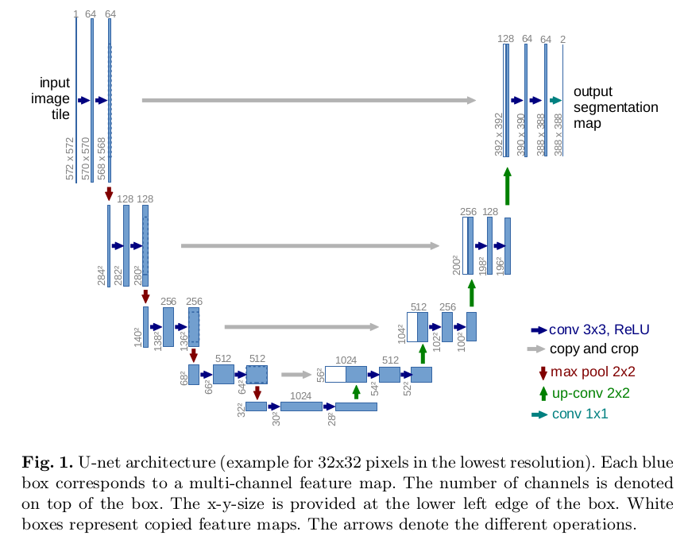

U-Net: Convolutional Networks for Biomedical Image Segmentation
=

训练：

使用softmax的交叉熵损失：
$$E = \sum_{x\in \Omega} w(x)\log(p_l(x)(x)$$
其中 $p_l(x)$ 是softmax输出概率值， $l \in \{1, ..., K\}$ ， $K$ 为类别数。$w(x)$ 为引入的权重图：
$$w(x) = w_c(x) + w_0 \exp(-\frac{(d_1(x) + d_2(x))^2}{2\sigma^2})  \tag 2$$
其中 $w_c$ 平衡类别频率的权重图， $d_1$ 表示到最近细胞边界的距离， $d_2$ 表示到第二近细胞边界的距离。设置 $w_0 = 10$ ， $\sigma \approx 5$ 个像素。
