本文介绍一些用于视频分类的3D卷积网络。

#### 1. C3D

##### 1.1. 网络结构

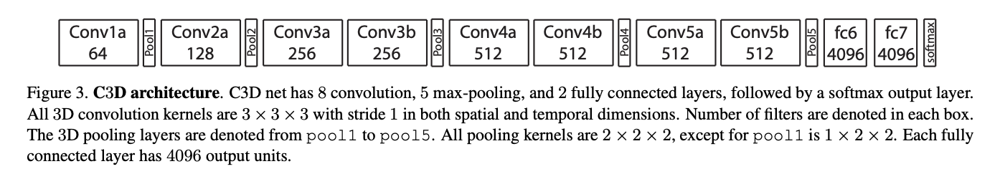

图3为C3D网络架构，其中所有卷积均为$3 \times 3 \times 3$。

##### 1.2. 训练

1. Sports-1M数据集

   ​		Sports-1M包含1.1M运动视频，每个视频属于487个运动类别中的一个。在Sports-1M训练集上训练。由于Sports-1M有许多长视频，我们从每个训练视频中随机抽取五个2秒长的clip。将clips调整为$128 \times 171$大小的帧。训练过程中，将输入clips随机裁剪为$16 \times 112 \times 112$的crop，以进行空间和时间上扰动。还以50%的概率水平翻转这些crop。使用SGD训练，mini-batch为30个样本。初始学习率为0.003，每150K迭代时，学习率除以2。共训练150K次迭代。结果见表2。

   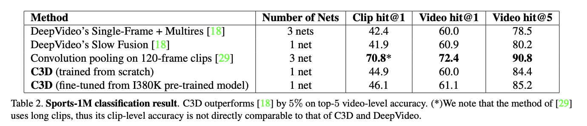

  2. UCF101

     ​		UCF101包含13320个视频，一共有101个人类行为类别。作者利用C3D提取特征，然后输入到多类的线性SVM。使用3个不同网络的C3D描述器进行实验：I380K上训练的C3D、Sprts-1M上训练C3D和在I380K上训练并在Sports-1M上微调的C3D。结果见表3。
     
     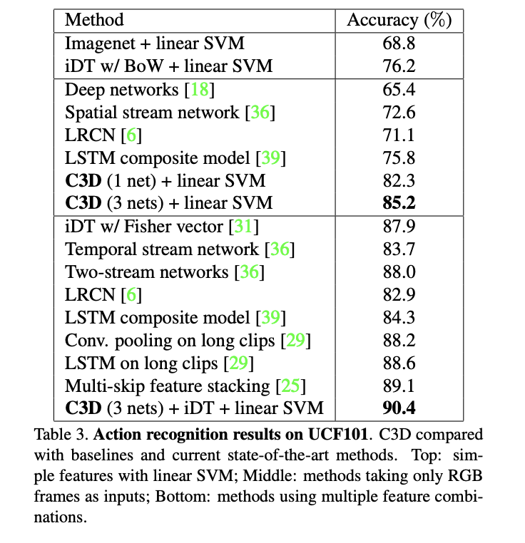

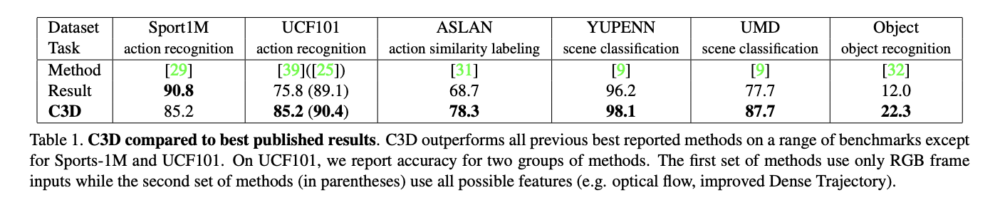

表1位C3D在各类数据集上的识别结果。

#### 2. Two-Stream Convolutional Networks for Action Recognition in Videos

​		作者研究了经过判别训练的深度卷积网络（ConvNets）的体系结构，以进行视频中的动作识别。 挑战在于从静止帧和帧之间的运动中获取外观上的补充信息。本文的贡献在三个方面：1）提出双流ConvNets架构，其包含空间和时序网络；2）证明了，尽管训练数据有限，但是在多帧密集光流上训练的卷积网络能够获得非常好的性能；3）证明将多任务学习应用于两个不同的动作分类数据集，可用于增加训练数据量并提高两者的性能。

##### 2.1. 网络结构

​		视频可以很自然地分解为空间和序列部分。空间部分包含单独帧的外观，并携带关于视频中描述场景和目标的信息。序列部分包含跨帧的运动信息，传递观察者（摄像机）和目标的运动。网络结构如图1。

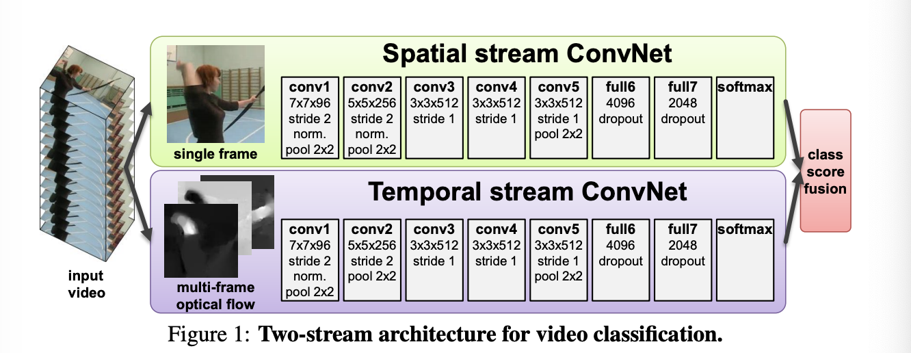

​		**Spatial stream ConvNet**在单独的视频帧上运算，有效地从静态图像上执行行为识别。其静态外观是有用的线索，因为某些行为与特定的目标有较强的关联。空间流卷积网络可以在ImageNet上预训练。

##### 2.2. 光流卷积网络

​		与一般的卷积网络不同，输入到光流卷积网络由几个连续帧之间光流位移场堆叠组成。如此显示地输入描述视频帧之间的运动，其使得识别更加容易，因为这样网络不需要隐式地估计运动。

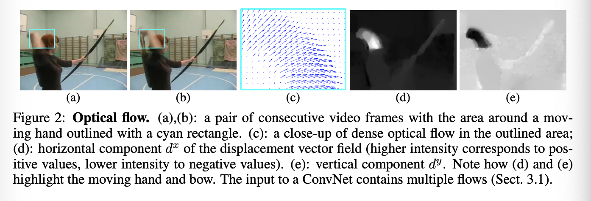

##### 2.2.1 ConvNet输入配置

**光流堆叠**  密集光流可以视为连续帧$t$和$t+1$之间的一组位移向量场$\mathbf{d}_t$。$\mathbf{d}_t(u,v)$表示帧$t$中点$(u,v)$出的位移场，其将当前点移动到接下来帧$t+1$中相应点。向量场中水平和垂直部分$d_t^x$和$d_t^y$可以视为输入通道（如图2），非常适合使用卷积网络识别。为了表示跨帧序列的运动，作者堆叠了$L$个连续帧的光流通道$d_t^{x,y}$以组成共计$2L$的输入通道。令$w$和$h$为视频的宽和高，然后，任意帧$\tau$的ConvNet输入量$I_{\tau} \in \Bbb{R}^{w \times h \times 2L}$构造如下：

$$\begin{alignat}{2} &I_{\tau}(u,v,2k-1) = d_{\tau+k-1}^x(u,v), \\ &I_\tau(u,v,2k)=d_{\tau+k-1}^y(u,v), u=[1;w],v=[1;h],k=[1;L]. \end{alignat}\tag{1}$$

对于任意的点$(u,v)$，通道$I_\tau(u,v,c)(c=[1;2L])$编码了$L$帧序列上点$(u,v)$处的运动（如图3左）。

**轨迹堆叠**  受基于轨迹的描述子[29]启发的另一种运动表示，将沿几条帧在相同位置采样的光流替换为沿运动轨迹采样的光流。在这个案例中，输入volume $I_\tau$（对应帧$\tau$ ），有如下形式：

$$\begin{alignat}{2}&I_\tau(u,v, 2k-1)=d_{r+k-1}^x(\mathbf{p}_k), \\ &I_\tau(u,v,2k)=d_{\tau+k-1}(\mathbf{p}_k), u=[1;w],v=[1;h],k=[1;L] \end{alignat}\tag{2}$$

其中$\mathbf{p}_k$为沿轨迹的第$k$个点，其在帧$\tau$的位置$(u,v)$处开始，并通过如下的递推公式定义：

$$\mathbf{p}_1 = (u,v); \mathbf{p}_k = \mathbf{p}_{k-1} + d_{\tau + k - 2}(\mathbf{p_{k-1}}), k>1. \tag{3}$$

与输入表示（1）（其通道$I_\tau(u,v,c)$储藏位置$(u,v)$处的位移响亮）相比，输入（2）储藏轨迹上位置$\mathbf{p}_k$处的采样的向量（如图3右所示）。

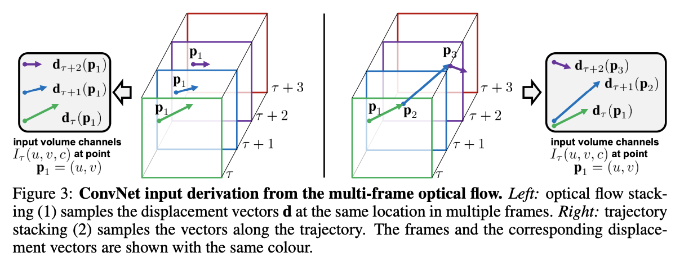

**Bi-directional optical flow.** 光流表示（1）和（2）处理前向光流，即帧$t$的位移场$\mathbf{d}_t$指定其像素在后续帧$t+1$中的位置。自然考虑将其扩展到双向光流，其可以通过计算相反方向的一组额外位移场而获得。然后，通过堆叠帧$\tau$和$\tau + L/2$之间的$L/2$前向流和$\tau-L/2$和$\tau$之间的$L/2$个后向流来构成输入$I_\tau$。因此，输入$I_\tau$与前面有相同数量$(2L)$的通道。可以使用两种方法（1）和（2）来表示流。

**Mean flow subtraction.**  通常，对网络输入进行零中心化是有益的，因为它允许模型更好地利用整流非线性。位移向量场分量既可以取正值，也可以取负值，并且自然地居中，这意味着在多种运动中，一个方向的运动与相反方向的运动一样。然而，给定一对帧，它们之间的光流可能被特殊的位移占据（例如相机移动引起的）。摄像机运动补偿的重要性先前在[10，26]中得到了强调，其中估计了整体运动分量并从密集流中减去了该分量。本例中，作者考虑了一种更简单的方法：**从每个位移场$\mathbf{d}$中减去其均值向量**。

**Architecture.**  上面描述了将多个光流位移场组合到单个volume$I_\tau \in \Bbb{R}^{w \times h \times 2L}$中。现在从$I_\tau$中采样$224 \times 224 \times 2L$的sub-volume作为输入。网络架构如图1所示。

#### 2.3. 多任务学习

​		与空间流ConvNet可以在大型静止图像分类数据集（例如ImageNet）上进行预训练不同，时间ConvNet需要在视频数据上进行训练-用于视频动作分类的可用数据集仍然很小。本文实验中，在UCF-101和HMDB-51数据集上进行训练，它们仅有9.5K和3.7K个视频。为了减少过拟合，可以将两个数据集组合成一个；但是，由于两个数据集类之间的交集，这并不是很简单。一个选项是（后面验证）仅添加交集的类中的图像，其没有出现在原始的数据集中。但是，这需要手动搜索这些类，并限制了其他训练数据的数量。

​		组合几种数据集更原则的方式是基于多任务学习。其目的是学习一种（视频）表示，该表示不仅适用于所讨论的任务（例如HMDB-51分类），还适用于其他任务（例如UCF-101分类）。添加的任务可以扮演正则化器，并允许利用额外的训练数据。修改ConvNet的架构使得在最后的全连接层的顶部有两个softmax分类层。一个softmax层计算HMDB-51分类分数，另一个计算UCF-101分数。每个层都配备了自己的损失函数，该函数仅对来自相应数据集的视频起作用。 总体训练损失以各个任务损失的总和来计算，网络权重导数可以通过反向传播找到。

##### 2.4. 实现细节

**卷积网络的配置.**  所有隐藏权重层使用ReLU激活，最大池化的核为$3 \times 3$，步幅为2，并添加LRN。空间卷积网络和时序卷积网络的区别是，时序卷积网络移除了第二个LRN以减少内存消耗。

**Training.**  训练过程可以看作是[15]对视频帧的一种适应，并且对于空间网络和时序网络通常都是相同的。使用SGD学习，mometum为0.9。在每次迭代中，通过对256个训练视频（均匀地跨类）进行采样来构造256个样本的小批量，从每个视频中随机选择一个帧。在训练空间网络时，从选择的帧中随机裁剪$224 \times 224$的子图像，然后随机水平翻转和RGB扰动。视频会预先进行缩放，以使帧的最小边等于256。然后从图像上随机裁剪$224 \times 224$的子图。初始学习率设置为$10^{-2}$，然后按照固定的时间表减少学习率，其对于所有训练集保持相同。即，当从头训练时，学习率在50K后变为$10^{-3}$，然后在70K迭代后变为$10^{-4}$，在80K迭代后停止训练。微调时，学习在14K迭代后改为$10^{-3}$，并在20K迭代后停止训练。

**Testing.** 在测试时，给定视频中，我们在它们之间相等时间间隔采样的固定（在我们的实验25）数量的帧。

**Optical flow** 使用来自OpenCV工具箱的[2]的现成GPU实现来计算光流。 尽管计算时间较快（一对帧为0.06s），但如果即时进行，它仍然会带来瓶颈，因此我们在训练之前预先计算了流量。为避免将位移场存储为浮点，将流的水平和垂直分量线性缩放为$[0,255]$范围，并使用JPEG压缩（解压缩后，将流重新缩放回其原始范围）。 这将UCF-101数据集的流大小从1.5TB减少到27GB。

##### 2.5. 结果

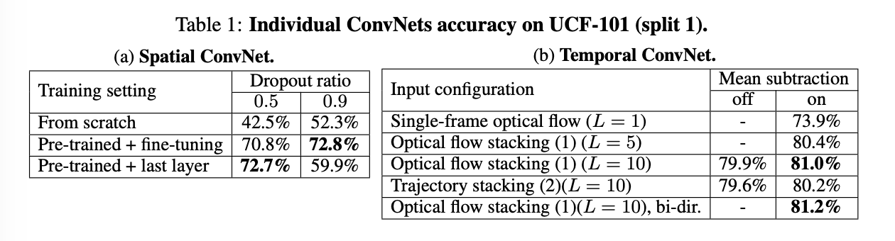

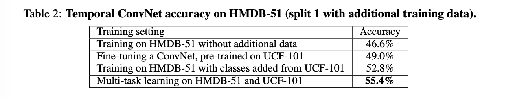

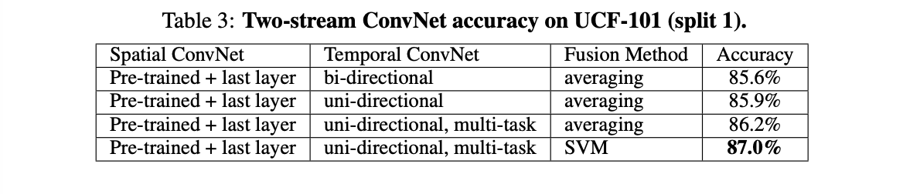

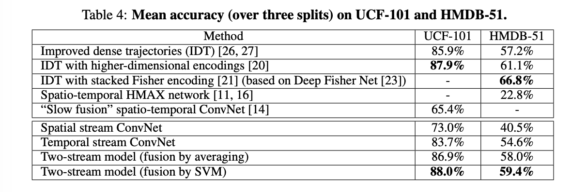

#### 3. Temporal Segment Networks: Towards Good Practices for Deep Action Recognition

​		本文开发了Temporal Segment Network，其基于长期时序结构建模的思想。它将稀疏时序采样策略和视频级的监督组合以保证用整个行为视频学习的效率。

##### 3.1. 研究的问题

​		基于视频的行为识别的两个障碍：1）长期序列结构在理解行为视频中的运动起着重要作用，主流方法缺少处理长期依赖的能力，很多方法使用预定义间隔的密集序列采样，这会使得将其应用到长视频序列时，会有过多的计算成本。2）ConvNets需要大量的训练样本来获得最优性能，然而公开可用的数据集在尺寸和变化上通常有限，使模型容易过拟合。

​		本文受两个问题启发：**1）如何设计一个有效的视频级框架来学习能够捕获长期时序结构的视频表示？2）如何在给定的有限训练样上学习卷积网络？**

##### 3.2. Temporal Segment Networks

​		双流卷积网络缺乏建模长期时序结构的能力，这主要是由于它们对时序上下文的访问受限，因为它们被设计为仅在短片段（时序网络）中的单个帧（空间网络）或单个帧堆栈上运行。但是，复杂的动作（例如体育动作）包括跨越相对较长时间的多个阶段。未能在ConvNet训练中利用这些动作中的长期时序结构，将是一大损失。为了处理这些问题，作者提出temporal segment network（TSN），如图1所示。

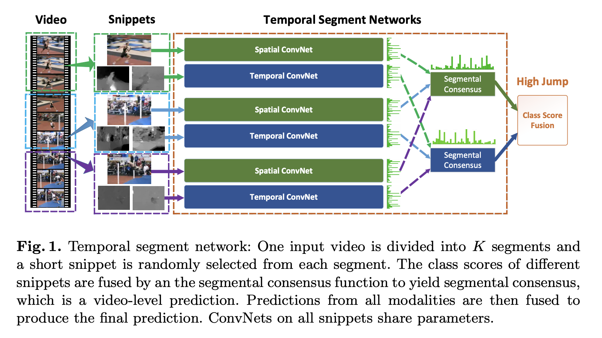

​		TSN由空间流卷积网络和时序流卷积网络组成，TSN在整个视频上稀疏采样的视频短片段序列上运行。序列中的每个短片段产生其行为类的初步预测。然后，片段之间的共识将被导出为视频级别的预测。在学习过程中，通过迭代更新模型参数来优化视频级预测的损失值，而不是两流ConvNet中使用的短片段级预测的损失值。

​		给定一个视频$V$，将其划分为$K$个相等持续片段（segments）$\{S_1, S_2, \cdots, S_K\}$；然后，TSN建模如下片段序列：

$$\mbox{TSN}(T_1, T_2, \cdots, T_K)=\mathcal{H}(\mathcal{G}(\mathcal{F}(T_1;\mathbf{W}),\mathcal{F}(T_2;\mathbf{W}), \cdots, \mathcal{F}(T_K;\mathbf{W}))). \tag{1}$$

这里$(T_1, T_2, \cdots, T_K)$为短片段（snippet）序列。每个snippet $T_k$从相应的segment $S_k$中随机采样。$\mathcal{F}(T_k;\mathbf{W})$为短snippet $T_k$上运行的有参数$\mathbf{W}$的卷积网络，并产生所有类上的类分数。分段共识函数（segmental consensus function）$\mathcal{G}$组合了多个短片段的输出，以获得其中的类假设的共识（consensus）。基于共识，预测函数$\mathcal{H}$预测整个视频上的每个行为的类概率。对于$\mathcal{H}$，采用softmax函数。与标准的分类交叉熵损失组合，与segmental共识（$\mathbf{G} = \mathcal{G}(\mathcal{F}(T_1;\mathbf{W}),\mathcal{F}(T_2;\mathbf{W}), \cdots, \mathcal{F}(T_K;\mathbf{W}))$）的最终的损失函数wei：

$$\mathcal{L}(y, \mathbf{G})=-\sum_{i=1}^Cy_i(G_i -\log \sum_{j=1}^C\exp G_j), \tag{2}$$

其中$C$为行为类的数量，$y_i$为类$i$的ground-truth标签。在实验中，**短片段（snippet）的数量$K$设置为3**。共识函数 $\mathcal{G}$ 的形式是一个公开问题，本文中，使用最简单形式的$\mathcal{G}$，其中$G_i = g(\mathcal{F}_i(T_1), \cdots, \mathcal{F}_i(T_K))$。在这里，使用聚合函数$g$从所有片段上的相同类别的分数推断出类别分数$G_i$。根据经验评估了聚合函数$g$的几种不同形式，包括实验中的平均、最大和加权平均。最终使用平均报告识别准确率。

##### 3.3. 学习TSN

**网络架构**  采用具有Batch Normalization的Inception，空间流ConvNets输入单幅RGB图像，时序流ConvNets输入堆叠的连续光流场。

**网络输入**  

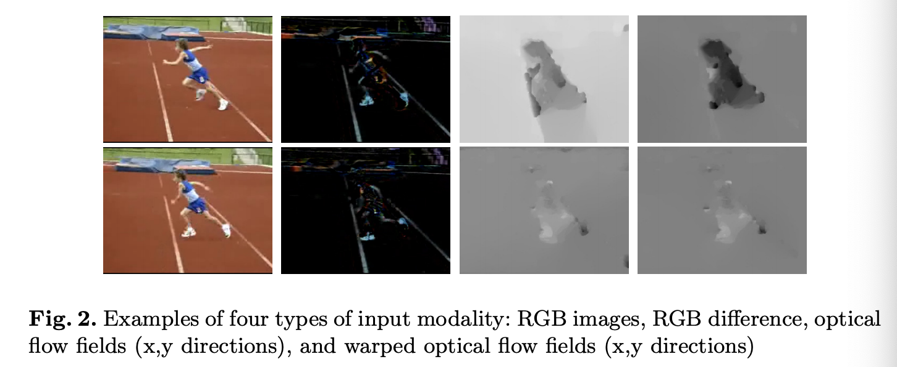

**网络训练**  为了缓解过拟合问题，作者提出了如下的训练策略：

​		_Cross Modality Pre-training._ 空间网络在ImageNet上预训练。作者开发了利用RGB模型来初始化序列网络的跨模态预训练技术。首先，通过线性变换将光流场离散化到0到255之间，使光流场与RGB图像保持相同。然后，将RGB的第一个卷积层的权重修改为处理光流场的输入，具体而言，对RGB通道上的权重取平均值，然后重复这个平均值时序网络输入的通道数次数。这种初始化方法对于时序网络很好，并且减少过拟合的影响。

​		_Regularization Techniques._  BN不仅会加速网络收敛，还导致在迁移过程中产生过拟合（由有限训练样本估计的激活分布的偏差）。因此，在预训练后，固定BN层的均值和方差参数。由于光流与RGB图像的差异，第一个卷积层的激活值有不同的分布，作者相应的重新估计它们的均值和方差，称为**partial BN**。同时，在全局池化层后还添加**dropout**层，空间流卷积网络的dropout ratio设置为0.8，时序流的卷积网络设置为0.7。

​		_Data Augmentation._  从图像的四个角或中心随机裁剪图像，将图像或光流场的大小固定为$256 \times 340$，并从$\{256, 224, 192, 168\}$中随机选择一个值作为裁剪区域的宽和高。训练时调整为$224\times224$。

##### 3.4. 测试TSN

​		从行为视频上采样25个RGB帧或光流，同时裁剪4个角和1个中心，并水平翻转采样的帧，空间和时序网络的融合采用加权平均。

##### 3.5 实验

###### 3.5.1 数据集和实现细节

​		使用SGD，momentum设置为0.9，batch_size为256。使用ImageNet预训练模型。对于空间网络，初始学习率设置为0.001，没2000次迭代减小为初始值的$\frac{1}{10}$，共训练4500次。对于时序网络，初始学习率为0.005，在12000和18000迭代减小到初始学习率的$\frac{1}{10}$，共迭代20000次。采用水平翻转、以及3.3节中的数据增强。使用TVL1来提取光流。

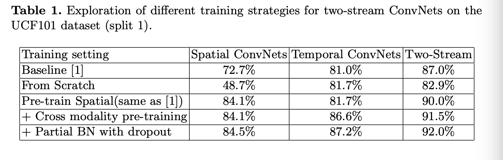

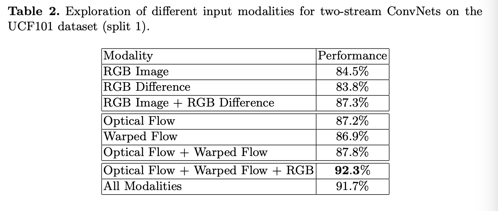

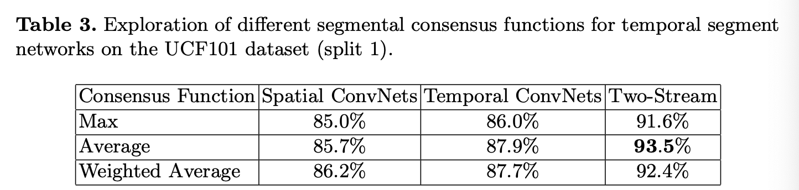

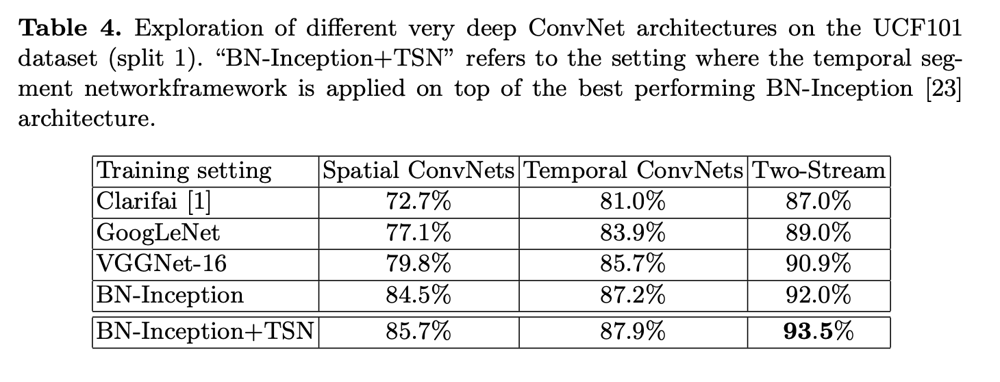

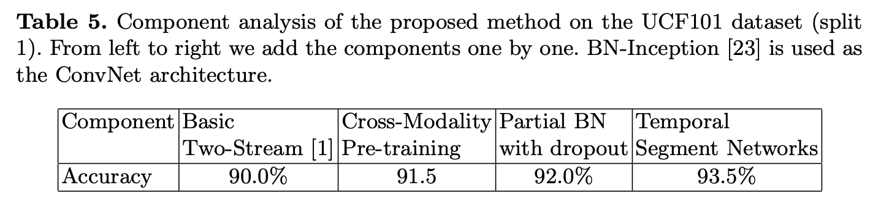

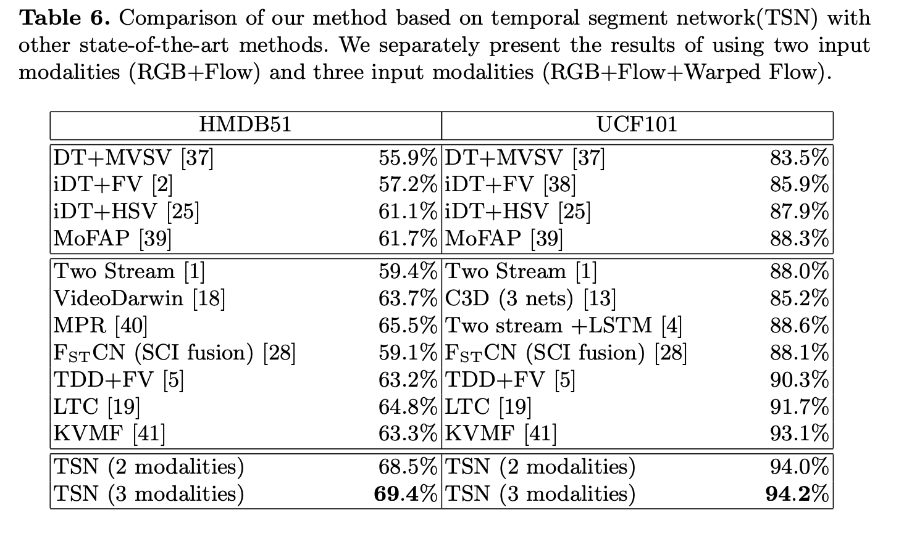

#### 4. P3D

​		利用$1 \times 3 \times 3$卷积和$3 \times 1 \times 1$卷积替换标准的$3 \times 3 \times 3$卷积，可以利用预训练的$3 \times 3$卷积来初始化$1 \times 3 \times 3$卷积，这样的卷积层为Pseudo-3D Residual Net（P3D ResNet）。

##### 4.1. Pseudo-3D Blocks

​		**Residual Units.**  ResNet的一般组成形式为

$$\mathbf{x}_{t+1}=\mathbf{h}(\mathbf{x}_t) + \mathbf{F}(\mathbf{x}_t), \tag{1}$$

其中$\mathbf{x}_t$和$\mathbf{x}_{t+1}$为第$t$个残差单元的输入和输出，$\mathbf{h}(\mathbf{x}_t=\mathbf{x}_t)$为恒等映射，$\mathbf{F}$为非线性残差函数。因此，公式（1）可重写为

$$(\mathbf{I+F})\cdot \mathbf{x}_t = \mathbf{x}_t + \mathbf{F}\cdot\mathbf{x}_t:=\mathbf{x}_x+\mathbf{F}(\mathbf{x}_t)=\mathbf{x}_{t+1}, \tag{2}$$

其中$\mathbf{F}\cdot\mathbf{x}_t$表示$\mathbf{x}_t$上残差函数$\mathbf{F}$的结果。图2描述了三种P3D块，详细瓶颈设计如图3。

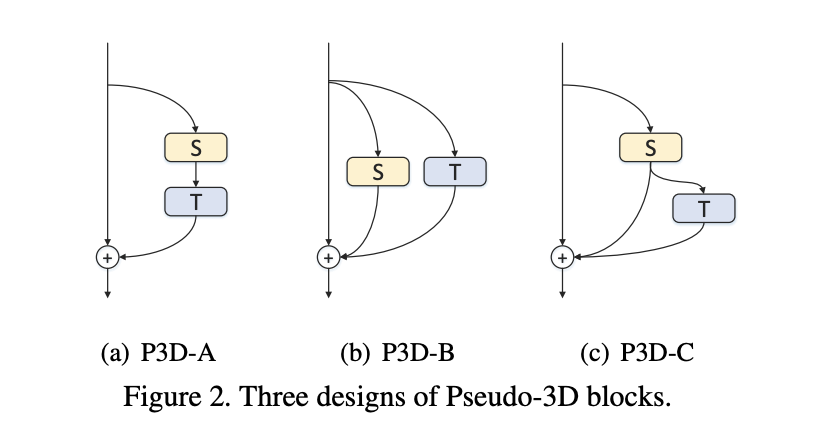

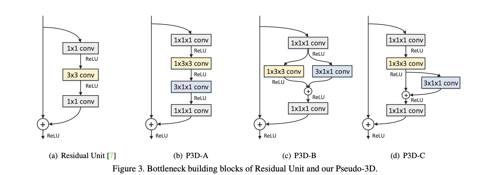

##### 4.2 Pseudo-3D ResNet

​		**Comparisons between P3D ResNet variants.**  在UCF101视频行为识别数据集上进行比较。具体而言，ResNet-50在UCF-101视频数据上微调，从$240 \times 320$的视频帧上裁剪$224 \times 224$图像，冻结批归一化层（除了第一层），并添加dropout层，dropout率为0.9。批大小设置为128frames/clips，初始学习率0.001，在3K迭代后除以10，共训练7.5K迭代。表1为比较结果。

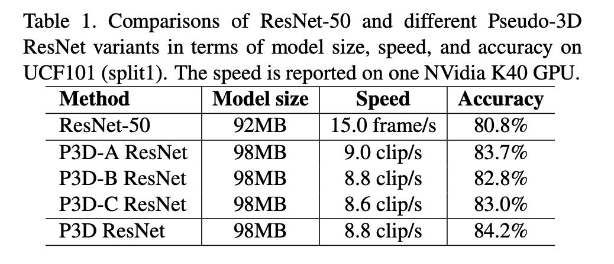

​		**Mixing different P3D Blocks.**  作者设计了混合不同P3D块的完整P3D ResNet，如图4，其结果见表1的最后一行。

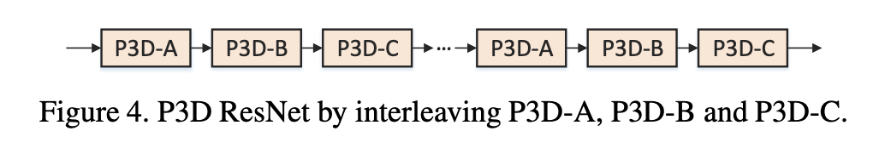

##### 4.3. Spatio-Temporal Representation Learning

​		完整版本的P3D ResNet源于152层的ResNet。

​		**Network Training.**  在Sports-1M训练集上训练，从训练集的每个视频上随机选择5秒的短视频。使用4.2节的设置，除了将dropout率设置为0.1，初始学习率为0.001，每60K迭代后除以10，共训练150K次迭代。

​		**Network Testing.**  作者通过在测试集上衡量video/clip分类准确率来评估学习过的P3D ResNet的性能。具体而言，从每个视频中随机采样20个clips，并在每个clip上菜哟过中心裁剪，裁剪传播过网络获得预测分数。视频级分数为所有clip-level的分数平均。与历史最佳的模型的比较如表2所示。

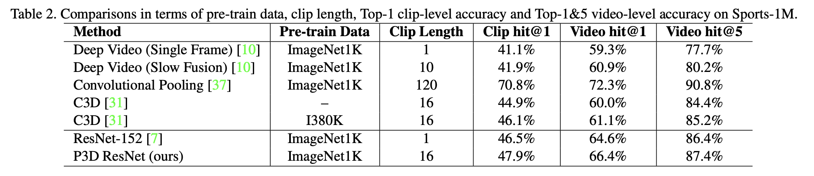

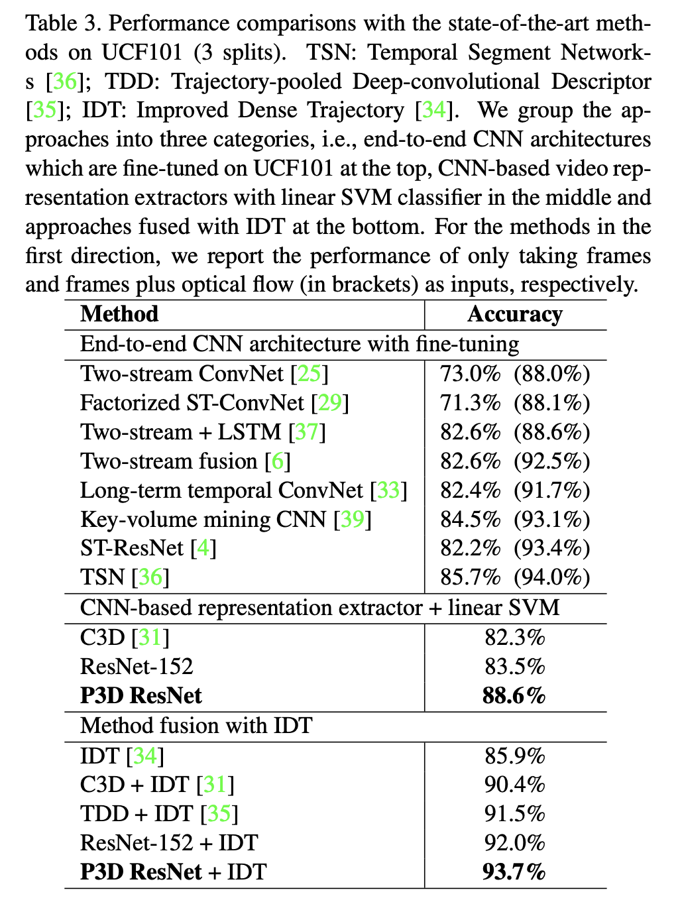

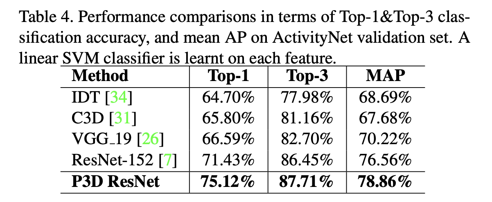

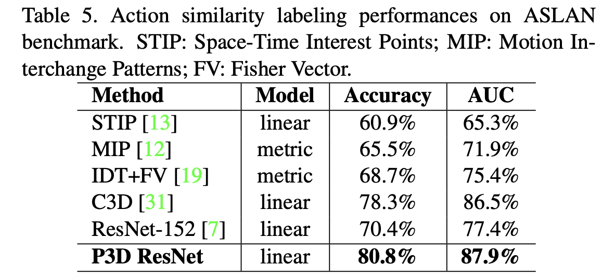

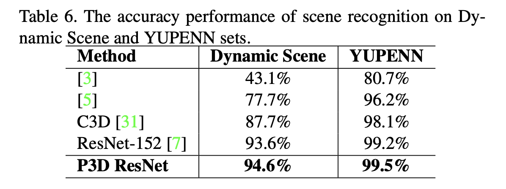

#### 5. T3D

##### 5.1. 算法介绍

​		行为识别的复杂方面包括：（i）已有的视频分析模型架构的参数比2D ConvNets多；（ii）训练视频分析模型需要大型标签数据集；（iii）光流图的提取和使用非常苛刻，并且获取大尺度数据集也很困难（例如Sports-1M）。这些问题对于它们计算成本和性能都是负影响。有两种方法来回避这些局限：（i）有效捕获视频中外观和时序信息的架构，因此避免了光流的使用；（ii）高效的监督迁移弥补了不同架构之间的知识迁移，使得不再需要从头训练网络。

​		T3D的架构图1所示。T3D旨在建模更长和更短时间范围的可变时序3D卷积核深度。成这新的层为“Temporal Transition Layer”（TTL）。T3D修改自DenseNet，将DenseNet的卷积核和池化核改为3D，称为DenseNet3D。T3D可以从短期、中期和长期项中密集高效地捕获外观和时间信息。

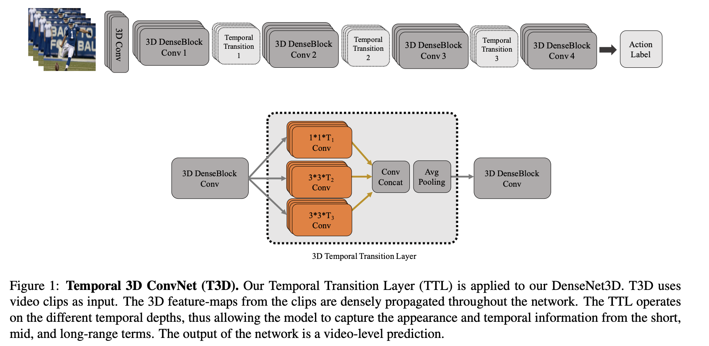

​		T3D还开发了跨架构的监督迁移，使用预训练的2D CNN作为教师模型来指导3D CNN训练，使3D CNN获得稳定的权重初始化。

##### 5.2. Temporal Transition Layer

TTL（见图1）特点如下：

1. 专门设计成时域特征提取层，有不同时域深度，不同于3D同质的卷积深度；

2. 2Dfilter和pooling参考了DenseNet的架构，扩展成了DenseNet3D，所以TTL基本上是C3D、NetworkInNetwork、DenseNet架构的综合体；

3. TTL是稠密传播(densely propagated)的，在T3D上是端到端可训练的。

##### 5.3. Supervision or Knowledge Transfer

​		令$\mathcal{I}$为ImageNet上预训练的2D ConvNet（本文为DenseNet-2D），$\mathcal{V}$为随机初始化的3D ConvNets（本文为DenseNet-3D），现在需要$\mathcal{I}$的知识迁移到$\mathcal{V}$以进行稳定的权重初始化，$\mathcal{I}$为教师模型。该方法利用帧和视频片段之间的对应关系，给定统一时间戳的$X$帧和视频clip，二者的视觉信息是相同的。作者利用2D和3D ConvNet架构之间的图像-视频对应来学习中级的特征表示，如图2。DenseNet-2D有4个2D-DenseBlocks以及末端有一个全连接层，而3D架构有4个3D DenseBlock，并在末端添加一个全连接层。然后将两个全连接层拼接（concat），并将它们与2048位的fc层项链，然后连接到大小为512和128的两个全连接层（fc1，fc2）和最后的二值分类器层。然后，使用简单的二值（1/2）匹配分类器：给定$X$帧和视频clip，决定它们是否属于相同。

​		训练期间，冻结$\mathcal{I}$参数，同时任务是有效地学习$\mathcal{V}$的模型参数，而无需在帧视频之间的对应关系上进行任何额外的监督。作者使用500K未标记的视频clip训练。

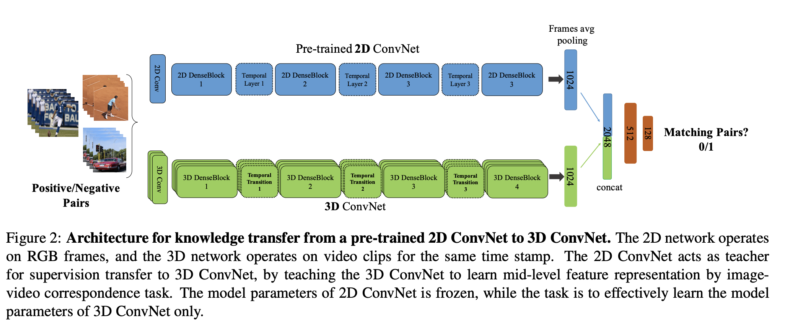

##### 5.4. 实验

​		模型的架构如表1。

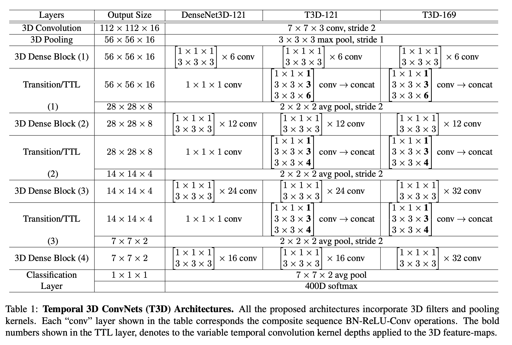

​		实验细节：

​		**Supervision Transfer：** $2D \rarr 3D$ CNN，对于2D CNN，采用32个RGB图像作为输入，并将其大小裁剪为$224 \times 224$，然后减去均值。使用SGD训练，batch_size为32，权重衰减为$10^{-4}$ ，Nesterov momentum为0.9，初始学习率设置为0.1，在每30个epoch后除以10，共迭代150个epoch。

​		**Temporal 3D ConvNets.**  在Kinetics上从头训练T3D，采用32个RGB的堆叠，将视频帧的短边调整为256个像素，然后从四个角和一个中心随机裁剪成$224 \times 224$，并随机水平翻转。使用SGD训练，权重衰减为$10^{-4}$，批大小为64。初始学习率设置为0.1，当验证损失饱和时除以10，在Kinetics数据集上训练200个epochs。

​		**Testing：** 对于视频预测，将每个视频分解为不重叠的32帧的clip。然后在中心裁剪的$224 \times 224$ clip上应用T3D，最后求所有clip预测的均值，从而获得视频级预测。

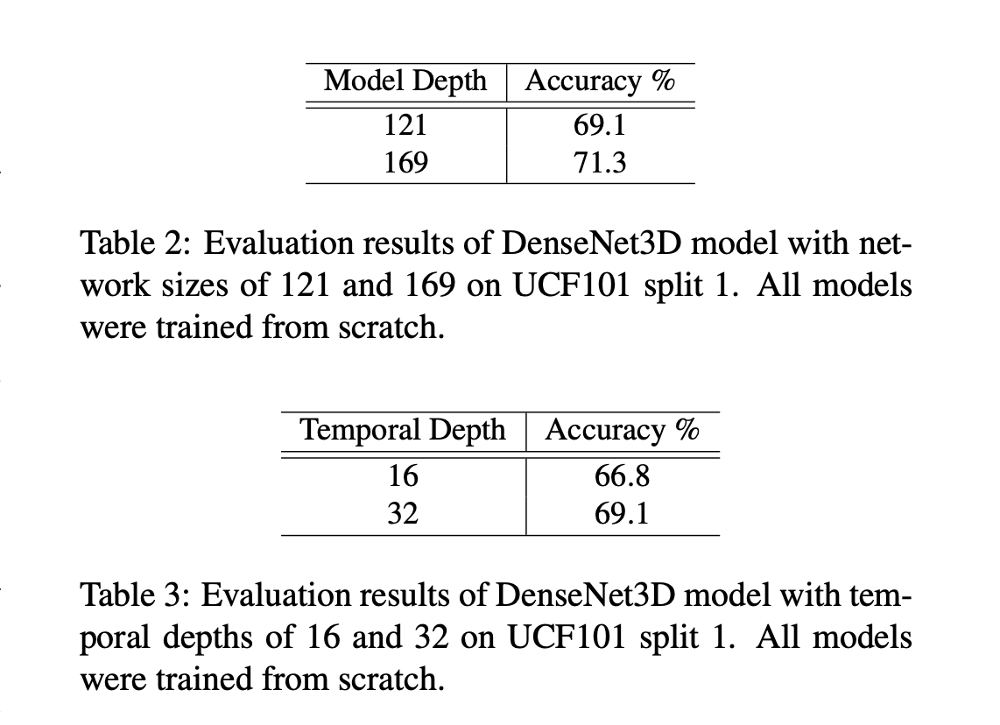

​		**Frame Resolution：** 表5给出了不同帧分辨率的分类结果。

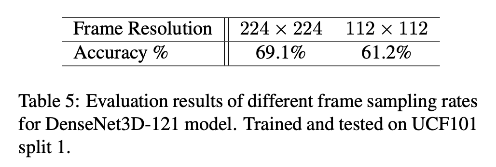

​		**Frame Sampling Rate：** 表6为不同采样率（输入帧的时序步长）下的预测结果，最佳的采样率为2。

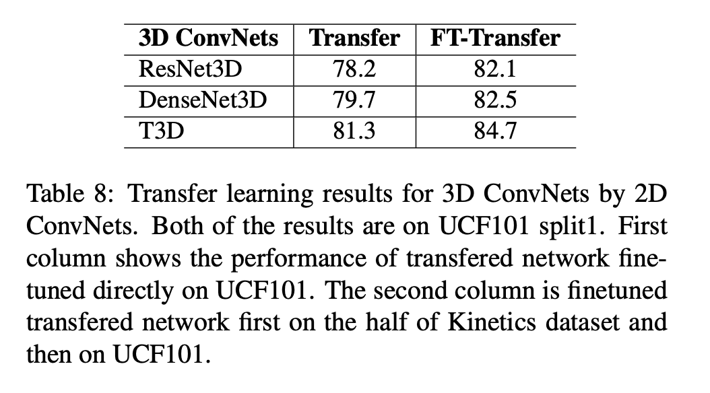

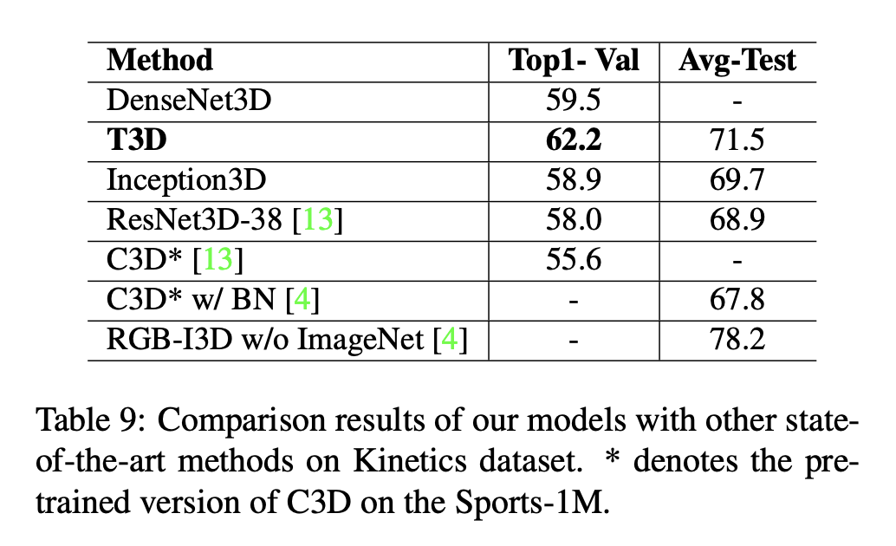

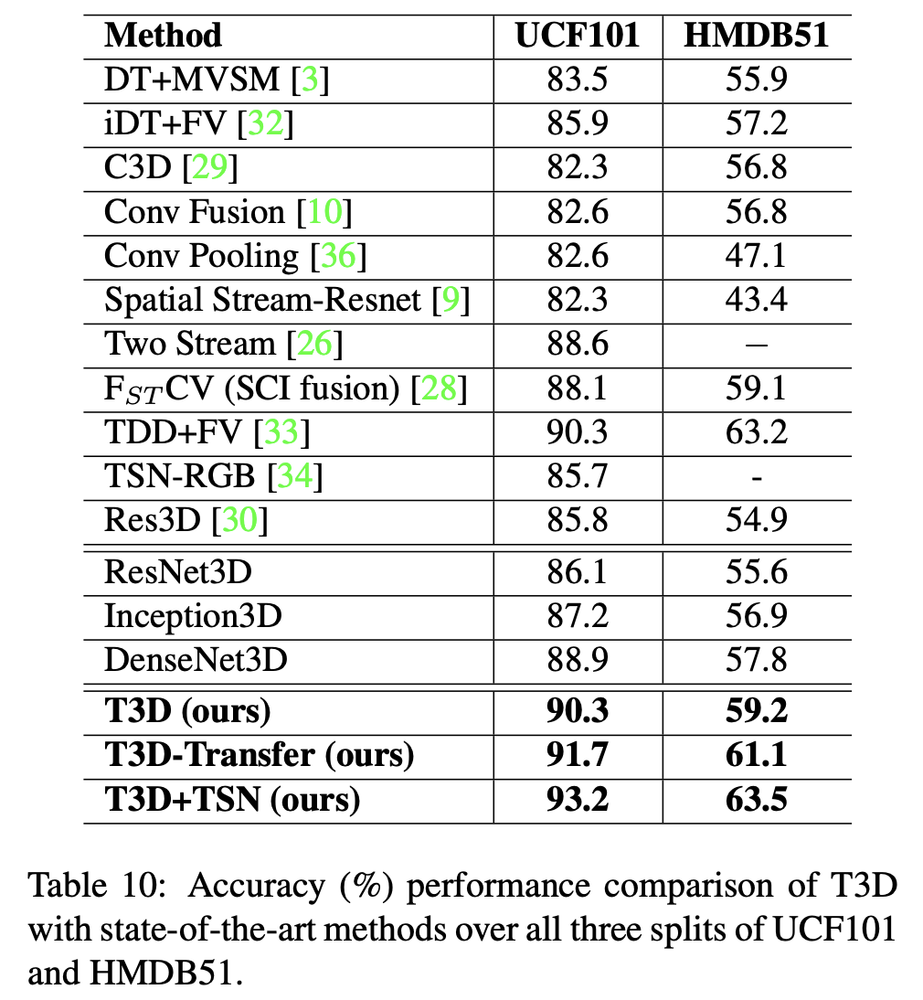

#### 6. Res3D

##### 6.1.  算法介绍

​		妨碍开发强壮视频分类架构的三个方面是（1）与图像模型相比，视频ConvNets有更高的计算和内存成本（[41]介绍了在UCF101训练需要3到4天，在Sports-1M上需要两个月）；（2）不存用于视频架构搜索的标准基准（从头训练UCF101模型的准确率在41-44%之间，从Sports-1M微调获得了82%的准确率）；（3）设计视频分类模型是不平凡的，有许多选择会影响性能，包括如何采样和预处理输入、卷积的类型、使用多少层和如何建模时序维度（例如联合空间-时间建模或解藕空间和时间维度）。

​		作者通过在小型基准（UCF101）上进行精心设计的架构搜索来解决这些问题。并通过下面两点来处理UCF101上的过拟合：（1）将网络限制为具有相似的容量（参数数量）-它们仍然会过拟合，但是准确性的提高可以更有把握地归因于架构的单一变化，而不是容量的变化；（2）对这种小数据集架构搜索的结果产生了高效的深度3D残差ConvNet架构（我们称为Res3D），当在更大的数据集（Sports-1M）上进行训练时，证明该架构是有效的，并在不同的视频基准上产生了可观的结果。

##### 6.2. 3D Residual Networks

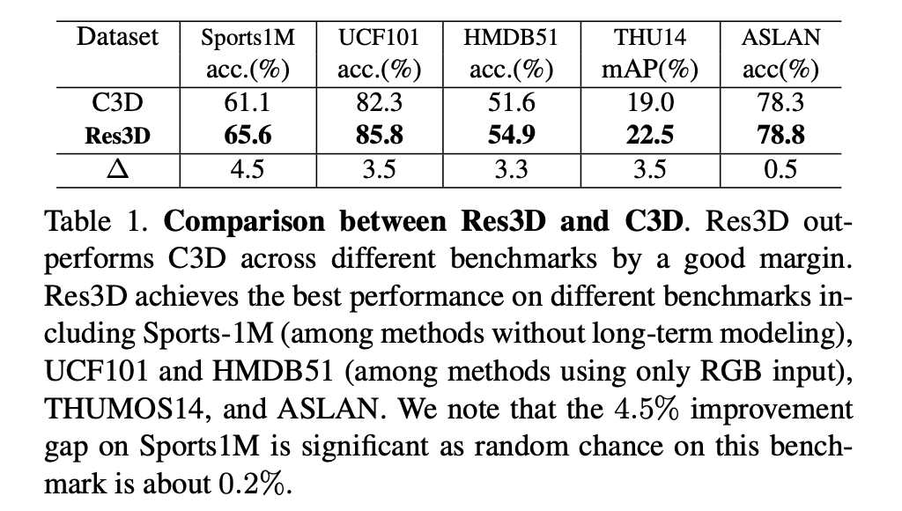

​		**Basic architectures：** 本文提出的基础3D ResNet架构如表2。网络输入为$8 \times 112 \times 112$，其为匹配GPU内存限制和维持足够大的mini-batch。跳过其他所有帧，这等价于使用C3D输入并丢弃偶数帧。具体架构为将2D-ResNet的输入$224 \times 224$改为$8 \times 112 \times 112$；将所有卷积从$d \times d$改为$3 \times d \times d$，去掉最大池化层，下采样卷积的步长设置为$2 \times 2 \times 2$，而第一个卷积的步长为$1 \times 2 \times 2$。

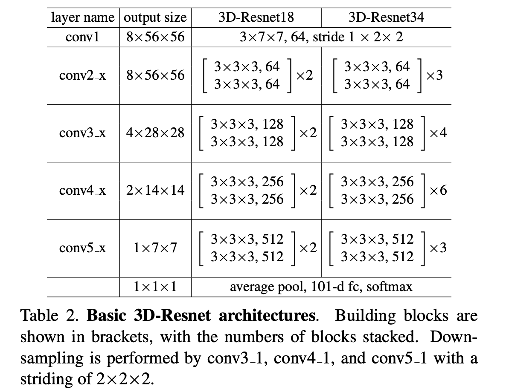

​		**Training and evaluation：** 使用SGD训练，mini-batch大小为20。与C3D相似，将视频帧调整到$128 \times 171$，并从中裁剪$112 \times 112$的子图，将初始学习率设置为0.01，并在每20K迭代后除以10。表3为UCF101 test split1上视频片段的准确率。

​		**Simplified networks：** 是使用更小输入$4 \times 112 \times 112$，但需要将conv5_1的步长调整为$1 \times 2 \times 2$。这种简化将3D-Resnet18的复杂性从193亿个浮点运算（FLOP）减少到103亿个FLOP，同时保持了UCF101的准确性（在随机机会的范围内，为0.96％）。

##### 6.3. 几个观察

​		**观察1:** 使用8帧的输入和深度18的网络（SR18）获得良好的基线性能，并能在UCF101上快速训练。

​		**观察2:** 对于视频分类，每2-4帧采样一帧（对于25-30fps的视频），并使用0.25s和0.75s之间的片段产生良好的准确率。

​		**观察3:** 在给定GPU内存限制下，128的输入分辨率（裁剪112）对于计算复杂度和视频分类准确都是理想的，结果见表15。

​		**观察4:** 在所有层上使用3D卷积可以提高视频分类性能（表16）。

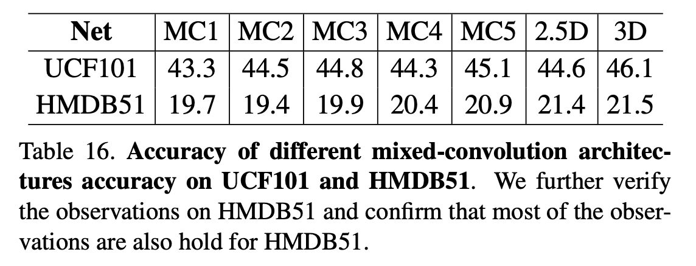

​		**观察5:** 18层的网络深度给定在准确率、计算复杂度和内存之间的良好平衡。

##### 6.4. Spatiotemporal feature learning with 3D Resnets

​		在Sports-1M上实验，使用表2的3D-ResNet18，与SR18相比，使用$8 \times 112 \times 112$的帧输入，时序步长为2，深度为18的全3D卷积。自此，成这种架构为Res3D。

​		**Training.**  从Sports-1M的每个训练视频中抽取2秒长的clip，然后将clip调整到$128 \times 171$，然后随机裁剪为$8 \times 112 \times 112$（采样步长为2）。在2个GPU上，以mini-batch大小40（每个GPU的批大小为20）使用SGD训练。初始学习设置为0.01，每250K迭代后除以2，共训练3M迭代。Sports-1M上的结果如表8。

​		表9为C3D与Res3D的比较：

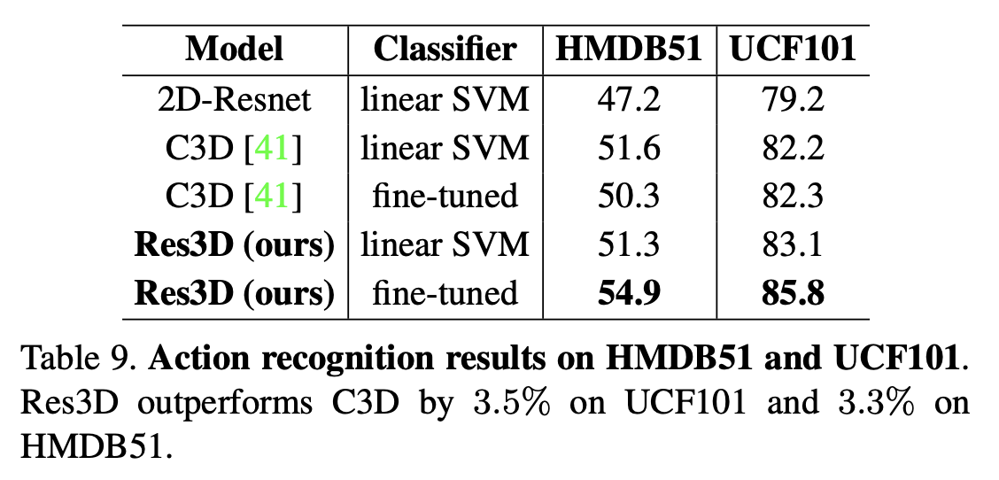

