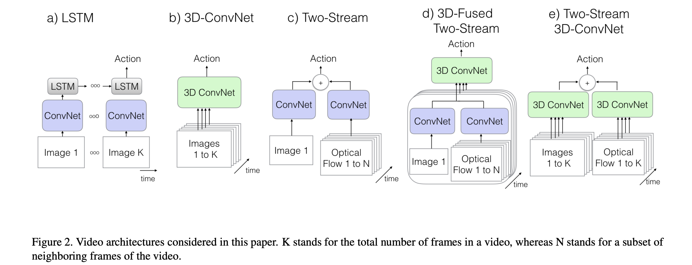
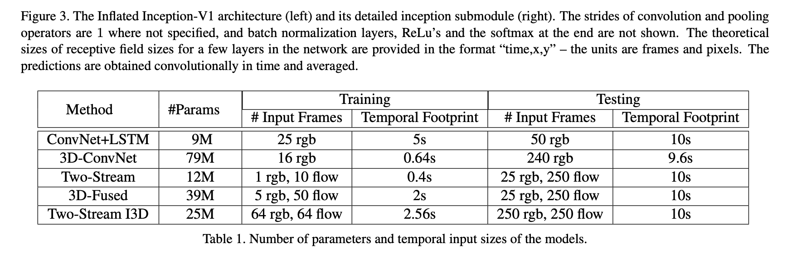
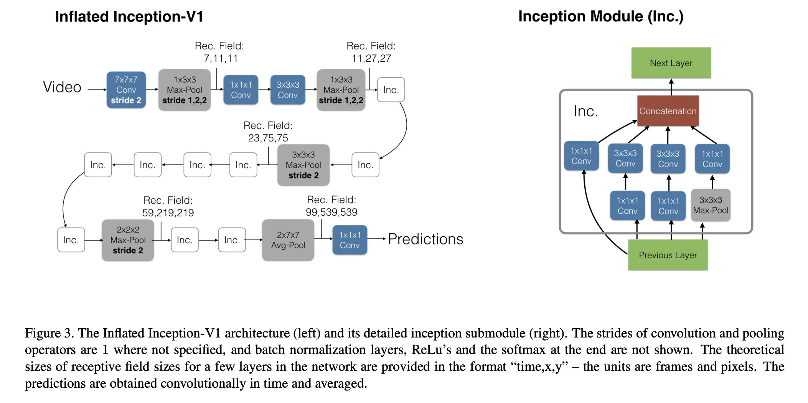
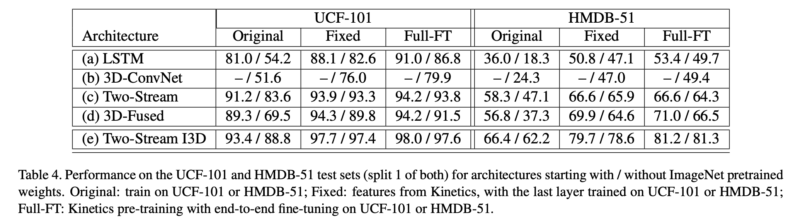

### Quo Vadis, Action Recognition? A New Model and the Kinetics Dataset

#### 2. Action Classification Architectures

​		下面介绍5种类型的架构，如图2。

##### 2.1 The Old I: ConvNet+LSTM

​		循环神经网络（如LSTM）与图像分类模型的结合可以弥补仅使用图像分类算法不能捕获时序信息核长期依赖的缺点。作者将具有批归一化层的LSTM放置于Inception-V1的最后一个均值池化层之和，LSTM有512个隐藏单元，在顶部添加全连接层进行分类。

​		在所有时间步骤上使用交叉熵损失训练模型。测试期间，仅考虑最后一帧的输出。从25fps的流上每5帧抽取一帧组成输入。表1列出所有模型的时序足迹。

##### 2.2. The Old II: 3D ConvNets

​		3D卷积网络比2D卷积网络有更多的参数，这使得它更难训练。作者实现了C3D[31]的小型变体，其有8个卷积层、5个池化层以及2个全连接层。模型输入16帧的$112 \times 112$像素的片段。与[31]不同的是，作者在所有卷积层和全连接层后添加归一化层。与原始版本的另一个差异是，在第一个池化层中，使用步长2而不是1，这减少内存并允许更大的batch。这使得在标准的K40 GPU上可以达到每个GPU每个批次15个视频。

##### 2.3. The Old III: Two-Stream Networks

​		在ConvNets的最后一层的特征上使用LSTM可以建模高级变化，但是可能不能捕获至关重要的低级运动。训练也很昂贵，因为它需要通过多个帧来展开网络以进行反向传播。

​		双流网络的输入为单个RGB帧和堆叠的10帧外部计算的光流帧，将输入传入ImageNet预训练的ConvNets后求取均值而获得预测。这里实现了3D版的Inception-V1，网络的输入是相隔10帧的5个连续RGB帧以及相应的光流片段。Inception-V1最后的平均池化层之前的空间和运动特征（$5 \times 7 \times 7$的特征网格，对应时间、x和y维度）通过512个输出通道为$3 \times 3 \times 3$的3D卷积层，接着是一个$3 \times 3 \times 3$的3D最大池化层和最后的全连接层。新加的层使用高斯噪声初始化。

##### 2.4. The New: Two-Stream Inflated 3D ConvNets

**Inflating 2D ConvNets into 3D.**  将2D架构的滤波器和池化核膨胀为3D，即由$N \times N$变为$N \times N \times N$。

**Bootstrapping 3D filters from 2D Filters.**  需要从预训练的ImageNet模型引导参数，将2D滤波器重复$N$次，然后除以$N$以重新缩放权重，这保证卷积滤波器的响应是相同的。

**Pacing receptive field growth in space, time and network depth.**  如何设置卷积/池化的时序步长？如果时间步长增长速度比空间快，它可能会融合来自不同对象的边缘，从而破坏早期的特征检测，而如果它增长得太慢，则可能无法很好地捕捉场景动态。

​		在Inception-V1中，第一个卷积层的步长为2，然后有4个步长为2的最大池化层和最后的线性分类层之前的$7 \times 7$的平均池化层。在本文的实验中，输入视频的处理速度为每秒25帧；作者发现在前两个最大池化层中不执行时序池化（使用$1 \times 3 \times 3$的核）是有用的，而在其他所有最大池化层中使用对称核核步长。最后的平均池化层使用$2 \times 7 \times 7$核。 整体架构如图3所示。**训练模型使用64帧短片段，测试使用真个视频，并平均时序上的预测**。

**Two  3D Streams.**   虽然3D ConvNets应当能够从RGB输入中直接学习运动特征，但是它仍然是纯粹的前馈计算，而光流算法的某种程度上循环的（例如它们对光流场进行迭代优化）。也许是缺乏重复性，在实验上作者发现双流配置很有价值——如图2（e）所示——一个I3D网络在光流输入上训练，而另一个在RGB输入上训练，该网络承载优化的平滑光流信息。作者独立训练两个网络，并在测试时平均它们的预测。

##### 2.5. Implementation Details

​		所有模型（除了类C3D的3D ConvNet）使用ImageNet预训练的Inception-V1作为基网络。每个卷积层后跟一个批归一化层和ReLU层，但最后一个用于产生类分数的卷积层不使用BN和ReLU。

​		使用momentum为0.9的SGD训练视频算法，并使用32个GPU，除非接收更大数量输入帧的3D ConvNets需要更多GPU（作者使用64个GPU）。在Kinetic上上训练110K步，当验证损失饱和时将学习率见下10倍。作者在Kinetics的验证集上调整学习率超参数。在UCF-101和HMDB-51上使用相似的学习率调整过程训练模型5K步，但是仅使用16个GPU。

​		训练期间采用数据增强包括：在足够早地选择起始帧以确保所需帧数时，将视频的短边调整到256个像素，然后随机裁剪出$224 \times 224$的块；对于更短的视频，根据需要循环播放了多次视频，以满足每个模型的输入；随机应用左右翻转；训练期间也采用photometric。测试时，在以$224 \times 224$的中心裁剪的视频上使用卷积，并平均预测结果。作者也尝试了$256 \times 256$的视频，但是没有观察到改进。光流使用TV-L1算法计算。

#### 3. The Kinetics Human Action Video Dataset

​		数据集包含400个类，每个类至少400个片段，每个视频片段来自唯一个视频，共计240k的训练视频。视频片段大约10s，也有未剪辑的视频。测试中，每个类包含100个片段。

#### 4. Experimental Comparison of Architectures

​		表2展示了在UCF-101、HMDB-51或Kinetics上训练和测试的分类准确率。可以得出结论，（1）ImageNet预训练可以扩展到3D ConvNets；（2）三种数据集的难度各异；（3）不同架构的排名几乎是一致的。

​		表2为从预训练的ImageNet权重开始训练与从头训练的模型的比较。

#### 5. Experimental Evaluation of Features

​	作者采用如下方法测量Kinetics上训练的网络的泛化能力。第一，冻结网络权重，并在UCF-101/HMDB-51数据集的视频（未见过）上使用网络产生特征。然后在UCF-101/HMDB-51训练集上训练多路softmax分类器，并在它们的测试集上评估。第二，在UCF-101/HMDB-51类上微调每个网络，并再次在UCF-101/HMDB-51测试集上评估。结果见表4。

##### 5.2 Comparison with the State-of-the-Art

